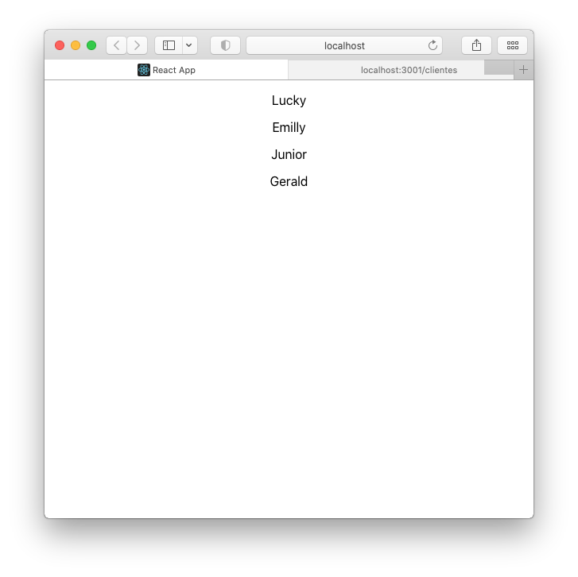
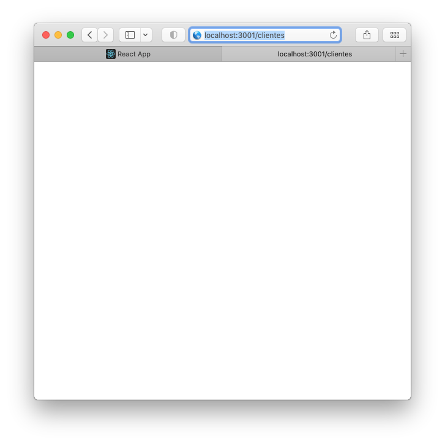

### GET autenticado com JWT
### React + NodeJS

<div>
  
  
</div>


- ### Login que retorna Token
```javascript
app.post("/login", (req, res) => {
    if (req.body.user === "felipe" && req.body.password === "123") {
        const token = jwt.sign({userId: 1}, SECRET, {expiresIn:300});
        return res.json({auth:true, token});
    }
    res.status(401).end();
});
```

- ### Função que verifica Token no Header
```javascript
function verify(req, res, next) {
    const token = req.headers["x-access-token"];
    jwt.verify(token, SECRET, (err, decoded) => {
        if (err) return res.status(401).end();
        req.userId = decoded.userId;
        next();
    })
}
```

- ### Rota protegida
```javascript
app.get("/clientes", verify, (req, res) => {
    var clientes = [
        {
            cliente : "Lucky"
        },
        {
            cliente : "Emilly"
        },
        {
            cliente : "Junior"
        },
        {
            cliente : "Gerald"
        }
    ]
    res.send(clientes);
});
```
